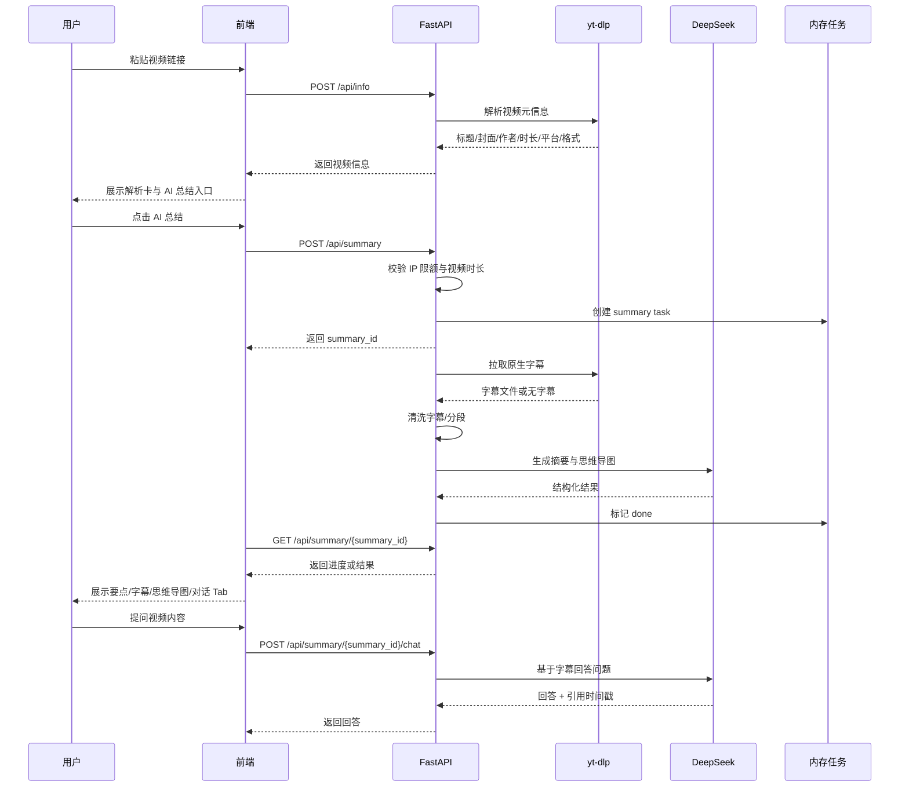
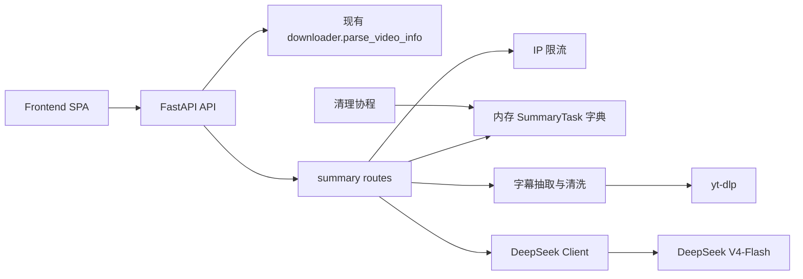

# AI 视频总结方案设计

> 版本：v1
> 日期：2026-05-01
> 状态：已实现并完成后端真实接口测试

## 1. 背景与目标

当前项目已经完成基于 `yt-dlp` 的核心视频解析与下载能力：用户可以粘贴公开视频链接、解析视频信息、选择清晰度、异步下载、查看进度并保存文件。下一阶段希望扩展 "AI 视频总结" 能力，帮助用户快速理解长视频内容，提升学习、研究和素材整理效率。

竞品 BibiGPT 与 NoteGPT 的共同范式是：

```text
视频链接 -> 获取字幕/转写 -> 结构化总结 -> 时间戳字幕 -> 思维导图 -> AI 对话 -> 导出/保存
```

本项目的差异化方向是把 "下载" 与 "总结" 放在同一个产品链路中，让用户在解析视频后可以选择：

- 下载原视频到本地。
- 直接生成 AI 总结。
- 后续扩展为 "下载 + 总结 + 字幕导出" 的学习资料包。

## 2. 已确认决策

| 决策项 | 结论 |
| --- | --- |
| MVP 功能范围 | 要点大纲 + 带时间戳字幕 + AI 对话 + 简易思维导图 |
| 字幕来源 | 只使用平台原生字幕；拿不到字幕时提示暂不支持 |
| ASR | MVP 不做 ASR 兜底 |
| LLM | DeepSeek V4-Flash，模型 ID：`deepseek-v4-flash` |
| LLM 模式 | 全程非思考模式 |
| 接入协议 | OpenAI Chat Completions 兼容协议 |
| 存储 | 继承现状：内存任务 + 临时文件，30 分钟 TTL |
| 前端形态 | 解析卡下方新增 AI 总结区域，使用 Tab：要点 / 字幕 / 思维导图 / 对话 |
| 免费策略 | 每 IP 每天 5 次，单视频最长 40 分钟，超出引导 Pro |
| 字幕语言优先级 | `zh-Hans` / `zh-CN` / `zh` -> `en` -> 原语言 -> 自动生成字幕 |

## 2.1 当前落地状态

当前版本已经完成 AI 视频总结 MVP 的主要开发和验证：

- 后端新增 `backend/app/summary/` 独立子模块，不侵入原下载任务实现。
- 已挂载接口：
  - `POST /api/summary`
  - `GET /api/summary/{summary_id}`
  - `POST /api/summary/{summary_id}/chat`
  - `DELETE /api/summary/{summary_id}`
- `POST /api/summary` 已在创建异步任务前同步校验 URL，避免无效链接创建错误任务。
- `backend/app/main.py` 已追加启动 AI 总结任务清理协程。
- `backend/app/summary/settings.py` 支持读取系统环境变量和 `backend/.env` 中的 `DEEPSEEK_API_KEY`。
- 前端已在解析结果卡中新增 "AI 总结" 按钮。
- 前端已新增总结结果卡，包含要点、字幕、思维导图、对话四个 Tab。
- 思维导图通过 `markmap-autoloader@0.18.12` 从 CDN 渲染，加载失败时降级为树形文本。
- 已使用带 `zh-CN` 字幕的 YouTube TED-Ed 视频完成真实总结和追问测试。

## 3. 范围

### 3.1 In Scope

- 解析成功后展示 "AI 总结" 入口。
- 创建 AI 总结异步任务。
- 使用 `yt-dlp` 拉取平台原生字幕。
- 按已确认语言优先级选择字幕。
- 清洗字幕并转换为统一的时间戳段落结构。
- 调用 DeepSeek V4-Flash 生成：
  - 结构化要点大纲。
  - Markdown 格式总结。
  - Markmap 可渲染的思维导图 Markdown。
- 展示带时间戳字幕。
- 支持基于字幕内容的 AI 追问。
- 每 IP 每天 5 次免费总结限流。
- 单视频总结时长限制为 40 分钟。
- 总结任务 30 分钟 TTL 清理。
- 前端展示进度、错误、结果 Tab 和对话面板。

### 3.2 Out of Scope

- ASR 语音转写。
- 用户账号系统。
- 数据库持久化。
- 历史记录 / 工作台。
- PDF / Word 导出。
- Notion / Obsidian 同步。
- 字幕翻译与双语字幕压制。
- 画面理解、关键帧识别、多模态总结。
- 多 worker 分布式任务队列。

## 4. 用户流程



## 5. 整体架构



### 5.1 后端模块

建议新增独立 summary 子模块，避免污染现有下载逻辑：

```text
backend/app/
├── summary/
│   ├── __init__.py
│   ├── models.py          # SummaryTask / SubtitleSegment / ChatMessage
│   ├── tasks.py           # 内存任务字典、TTL 清理
│   ├── subtitles.py       # 字幕拉取、语言选择、清洗、分段
│   ├── llm_client.py      # DeepSeek OpenAI-compatible client
│   ├── prompts.py         # 摘要 / 思维导图 / 对话 prompt
│   ├── pipeline.py        # 总结异步流程
│   └── rate_limit.py      # IP 每日限额
├── api.py                 # 新增 /api/summary 路由
└── config.py              # 新增 DeepSeek 与限流配置
```

### 5.2 前端模块

当前前端是 Vite + 原生 HTML/CSS/JS。AI 总结 MVP 仍沿用该技术栈，避免引入 React 等重型框架。

建议前端新增：

```text
frontend/src/
├── main.js                # 接入 AI 总结入口与轮询
├── summary.js             # Tab、字幕、思维导图、对话逻辑
└── styles.css             # AI 总结区域样式
```

当前前端实现：

- Markdown 摘要使用 `frontend/src/summary.js` 内置的轻量渲染函数，未新增 npm 依赖。
- 思维导图使用 `markmap-autoloader@0.18.12` CDN 自动渲染。
- 如果 Markmap CDN 加载失败，自动降级为树形文本展示。

## 6. 数据模型

### 6.1 SummaryTask

```python
@dataclass
class SummaryTask:
    summary_id: str
    url: str
    title: str | None
    platform: str | None
    status: Literal["queued", "extracting_subtitles", "summarizing", "done", "error"]
    pct: float
    stage_text: str
    created_at: float
    updated_at: float
    expires_at: float
    client_ip: str
    duration: int | None
    language: str | None
    segments: list[SubtitleSegment]
    outline_markdown: str | None
    mindmap_markdown: str | None
    summary_text: str | None
    chat_messages: list[ChatMessage]
    error: str | None
```

状态说明：

| 状态 | 含义 |
| --- | --- |
| `queued` | 任务已创建，等待后台执行 |
| `extracting_subtitles` | 正在通过 `yt-dlp` 抽取字幕 |
| `summarizing` | 正在调用 DeepSeek 生成摘要与思维导图 |
| `done` | 任务完成，可展示结果 |
| `error` | 任务失败 |

### 6.2 SubtitleSegment

```python
@dataclass
class SubtitleSegment:
    index: int
    start: float
    end: float
    start_text: str
    end_text: str
    text: str
```

字段说明：

- `start` / `end`：秒级时间戳，用于后续跳转与引用。
- `start_text` / `end_text`：格式化时间，例如 `00:03:21`。
- `text`：清洗后的字幕文本。

### 6.3 ChatMessage

```python
@dataclass
class ChatMessage:
    role: Literal["user", "assistant"]
    content: str
    created_at: float
```

MVP 不持久化对话，随 `SummaryTask` 一起保存在内存中，任务过期后清理。

## 7. 后端接口

### 7.1 创建总结任务

```http
POST /api/summary
Content-Type: application/json

{
  "url": "https://www.bilibili.com/video/...",
  "title": "可选，前端已解析到的视频标题",
  "duration": 1800
}
```

响应：

```json
{
  "summary_id": "abc123",
  "status": "queued"
}
```

校验规则：

- URL 必填，长度不超过现有 `MAX_URL_LENGTH`。
- 若前端传入 `duration` 且大于 40 分钟，直接拒绝。
- 后端仍要通过已解析信息或 `yt-dlp` 结果再次校验视频时长。
- 每 IP 每天最多 5 次。

错误示例：

```json
{
  "detail": "当前免费版每天最多总结 5 个视频，请明天再试或升级 Pro。"
}
```

```json
{
  "detail": "当前免费版仅支持总结 40 分钟以内的视频。"
}
```

### 7.2 查询总结任务

```http
GET /api/summary/{summary_id}
```

处理中响应：

```json
{
  "summary_id": "abc123",
  "status": "summarizing",
  "pct": 70,
  "stage_text": "正在生成视频要点和思维导图..."
}
```

完成响应：

```json
{
  "summary_id": "abc123",
  "status": "done",
  "pct": 100,
  "title": "视频标题",
  "platform": "Bilibili",
  "language": "zh-Hans",
  "outline_markdown": "...",
  "mindmap_markdown": "...",
  "summary_text": "...",
  "segments": [
    {
      "index": 1,
      "start": 0,
      "end": 12.4,
      "start_text": "00:00",
      "end_text": "00:12",
      "text": "本节介绍..."
    }
  ]
}
```

### 7.3 视频内容追问

```http
POST /api/summary/{summary_id}/chat
Content-Type: application/json

{
  "message": "这个视频最核心的 3 个知识点是什么？"
}
```

响应：

```json
{
  "answer": "核心知识点包括...\n\n引用：\n- 00:03:21 讲到...\n- 00:12:10 讲到...",
  "messages": [
    {
      "role": "user",
      "content": "这个视频最核心的 3 个知识点是什么？",
      "created_at": 1777566000
    },
    {
      "role": "assistant",
      "content": "核心知识点包括...",
      "created_at": 1777566002
    }
  ]
}
```

### 7.4 删除总结任务

```http
DELETE /api/summary/{summary_id}
```

用于用户主动清理总结结果。MVP 可以不暴露前端按钮，但后端保留接口便于测试与未来扩展。

## 8. 字幕策略

### 8.1 获取字幕

通过 `yt-dlp` 的 Python API 拉取字幕信息，优先使用 `subtitles`，其次使用 `automatic_captions`。

语言优先级：

```python
SUBTITLE_LANGUAGE_PRIORITY = [
    "zh-Hans",
    "zh-CN",
    "zh",
    "zh-Hant",
    "en",
]
```

选择规则：

1. 优先匹配人工字幕 `subtitles`。
2. 人工字幕没有目标语言时，再匹配 `automatic_captions`。
3. 若仍未命中，选择第一个可用字幕并记录 `language`。
4. 若没有任何字幕，任务失败并返回：

```text
当前视频没有可用字幕，AI 总结暂不支持。后续版本会加入语音转写能力。
```

### 8.2 字幕格式

优先选择：

1. `json3`：YouTube 常见，结构化更稳定。
2. `vtt`：WebVTT，适合通用解析。
3. `srt`：备选。

清洗目标：

- 去除重复字幕。
- 去除空白、HTML 标签、样式标签。
- 合并过短片段，避免 LLM 输入碎片太多。
- 保留 `start` / `end` 时间戳。

### 8.3 分段策略

字幕原始片段通常很短，建议聚合为 20-60 秒一段：

- 单段文本长度达到约 300-500 中文字符时截断。
- 时间跨度超过 60 秒时截断。
- 遇到明显章节标题或长停顿时可截断。

MVP 可以先做简单规则：

```text
累计文本 >= 400 字 或 时间跨度 >= 45 秒 -> 生成一个 Segment
```

## 9. DeepSeek 接入

### 9.1 配置项

新增环境变量：

```bash
DEEPSEEK_API_KEY=sk-...
DEEPSEEK_BASE_URL=https://api.deepseek.com
DEEPSEEK_MODEL=deepseek-v4-flash
SUMMARY_DAILY_LIMIT_PER_IP=5
SUMMARY_MAX_DURATION_SECONDS=2400
SUMMARY_TASK_TTL_SECONDS=1800
```

`config.py` 中增加默认值：

```python
DEEPSEEK_BASE_URL = os.getenv("DEEPSEEK_BASE_URL", "https://api.deepseek.com")
DEEPSEEK_MODEL = os.getenv("DEEPSEEK_MODEL", "deepseek-v4-flash")
SUMMARY_DAILY_LIMIT_PER_IP = int(os.getenv("SUMMARY_DAILY_LIMIT_PER_IP", "5"))
SUMMARY_MAX_DURATION_SECONDS = int(os.getenv("SUMMARY_MAX_DURATION_SECONDS", str(40 * 60)))
SUMMARY_TASK_TTL_SECONDS = int(os.getenv("SUMMARY_TASK_TTL_SECONDS", str(30 * 60)))
```

### 9.2 客户端

建议使用 `httpx.AsyncClient`，避免阻塞事件循环。

请求格式采用 OpenAI Chat Completions 兼容协议：

```json
{
  "model": "deepseek-v4-flash",
  "messages": [
    {
      "role": "system",
      "content": "你是专业的视频学习助理..."
    },
    {
      "role": "user",
      "content": "请总结以下字幕..."
    }
  ],
  "temperature": 0.2
}
```

超时建议：

- 摘要生成：120 秒。
- 对话回答：60 秒。

### 9.3 摘要 Prompt 输出格式

要求 DeepSeek 输出 JSON，后端解析后再返回前端，避免前端依赖模型自由文本。

目标结构：

```json
{
  "summary_text": "一段 200-400 字的视频总览",
  "outline_markdown": "## 视频大纲\n...",
  "key_points": [
    {
      "title": "核心观点",
      "timestamp": "00:03:21",
      "description": "..."
    }
  ],
  "mindmap_markdown": "# 视频主题\n## 第一部分\n- 要点"
}
```

如果 JSON 解析失败：

- 后端记录原始输出。
- 返回友好错误。
- 不把模型原始异常暴露给用户。

### 9.4 对话 Prompt

MVP 因为单视频限制 40 分钟，DeepSeek V4-Flash 支持 1M 上下文，可以直接把完整字幕段放入上下文。

对话要求：

- 使用中文回答。
- 回答必须基于字幕内容。
- 不知道时明确说 "字幕中没有足够信息"。
- 尽量引用时间戳。

## 10. 限流与防滥用

MVP 没有账号系统，采用 IP 级内存限流。

```python
SUMMARY_USAGE = {
    "127.0.0.1": {
        "date": "2026-05-01",
        "count": 3
    }
}
```

规则：

- 每 IP 每自然日最多 5 次。
- 超过限制返回 429。
- 服务重启后计数清空，MVP 可接受。
- 生产上线前建议改为 Redis 或数据库。

获取客户端 IP：

1. 优先读取 `X-Forwarded-For` 第一段。
2. 其次读取 `X-Real-IP`。
3. 最后使用 `request.client.host`。

注意：如果部署在反向代理后面，必须明确可信代理，否则 `X-Forwarded-For` 可能被伪造。

## 11. 前端设计

### 11.1 页面入口

解析成功后的结果卡中，在 "开始下载" 按钮旁新增：

```text
[开始下载] [AI 总结]
```

当用户点击 "AI 总结"：

- 若视频时长超过 40 分钟，前端先提示免费版限制。
- 调用 `POST /api/summary`。
- 展示总结任务卡，轮询 `GET /api/summary/{summary_id}`。

### 11.2 总结结果卡

新增区域结构：

```html
<article id="summaryCard" class="summary-card hidden">
  <div class="summary-head">
    <h3>AI 视频总结</h3>
    <span id="summaryStatus">准备中</span>
  </div>
  <div class="summary-tabs">
    <button data-tab="outline">要点</button>
    <button data-tab="transcript">字幕</button>
    <button data-tab="mindmap">思维导图</button>
    <button data-tab="chat">对话</button>
  </div>
  <div id="summaryContent"></div>
</article>
```

### 11.3 Tab 内容

要点 Tab：

- 展示 `summary_text`。
- 展示 `outline_markdown` 渲染后的 HTML。

字幕 Tab：

- 按时间顺序展示每个 `SubtitleSegment`。
- 每段展示开始时间、结束时间和字幕文本。
- MVP 暂不内嵌视频播放器，时间戳点击可复制时间或展示提示。
- 后续可以对 YouTube / B 站链接拼接时间戳跳转。

思维导图 Tab：

- 使用 `markmap-autoloader@0.18.12` 渲染 `mindmap_markdown`。
- CDN 加载失败时降级为树形文本，避免影响要点、字幕和对话 Tab。

对话 Tab：

- 展示消息列表。
- 输入框支持 Enter 发送。
- 调用 `POST /api/summary/{summary_id}/chat`。
- 回答中时间戳以高亮样式展示。

### 11.4 移动端适配

- Tab 横向滚动。
- 对话输入固定在卡片底部。
- 字幕段落单列展示。
- 思维导图容器支持横向滚动。

## 12. 错误处理

| 场景 | 用户提示 |
| --- | --- |
| 没有字幕 | 当前视频没有可用字幕，AI 总结暂不支持。后续版本会加入语音转写能力。 |
| 视频过长 | 当前免费版仅支持总结 40 分钟以内的视频。 |
| 每日限额用完 | 当前免费版每天最多总结 5 个视频，请明天再试或升级 Pro。 |
| DeepSeek API key 未配置 | AI 总结服务暂未配置，请联系管理员。 |
| DeepSeek 超时 | AI 总结生成超时，请稍后重试。 |
| 模型输出解析失败 | AI 总结结果格式异常，请重试。 |
| 任务过期 | 总结结果已过期，请重新生成。 |

## 13. 安全与合规

- 不绕过 DRM。
- 不支持私密、会员、登录态视频的额外绕过。
- 不长期保存视频、字幕、总结结果。
- 不把用户输入的 URL 写入公开日志。
- DeepSeek 调用会把字幕内容发送给第三方模型服务，页面需要增加提示：

```text
AI 总结会将视频字幕发送给模型服务生成结果，请仅处理你有权查看和分析的内容。
```

## 14. 开发拆解

### Step 1：后端基础模型与配置

- 新增 summary 子模块。
- 新增 `SummaryTask`、`SubtitleSegment`、`ChatMessage`。
- 新增配置项。
- 新增内存任务字典与 TTL 清理。

验收：

- 后端可启动。
- `GET /api/health` 正常。
- 不影响现有下载接口。

### Step 2：字幕抽取与清洗

- 用 `yt-dlp` 获取字幕元信息。
- 实现语言优先级选择。
- 下载字幕内容到临时目录或内存。
- 支持 `vtt` / `srt` / `json3` 至少一种稳定格式，优先 `vtt`。
- 转换为 `SubtitleSegment`。

验收：

- 对有字幕视频可以输出段落数组。
- 对无字幕视频返回明确错误。

### Step 3：DeepSeek 客户端与摘要生成

- 新增 `llm_client.py`。
- 新增摘要 prompt。
- 生成 `summary_text`、`outline_markdown`、`mindmap_markdown`。
- 处理超时、401、429、5xx 和 JSON 解析失败。

验收：

- 配置 `DEEPSEEK_API_KEY` 后可生成摘要。
- 未配置 key 时返回友好错误。

### Step 4：总结任务 API

- `POST /api/summary`。
- `GET /api/summary/{summary_id}`。
- `DELETE /api/summary/{summary_id}`。
- 后台异步执行总结 pipeline。
- 接入 IP 限流与视频时长限制。

验收：

- 创建任务后可轮询进度。
- 任务完成后返回完整结果。
- 每 IP 超过 5 次返回 429。

### Step 5：AI 对话 API

- `POST /api/summary/{summary_id}/chat`。
- 使用字幕段和历史消息调用 DeepSeek。
- 保存对话消息到内存任务。

验收：

- 可基于总结结果追问。
- 回答尽量包含时间戳引用。

### Step 6：前端入口与轮询

- 解析卡新增 "AI 总结" 按钮。
- 创建总结任务。
- 展示总结进度。
- 完成后渲染总结卡。

验收：

- 用户可从现有解析结果直接发起总结。
- 总结中、成功、失败状态清晰。

### Step 7：前端 Tab 与对话

- 要点 Tab。
- 字幕 Tab。
- 思维导图 Tab。
- 对话 Tab。
- 移动端样式。

验收：

- 四个 Tab 可以正常切换。
- 对话可发送与展示。
- 样式不破坏现有首页布局。

### Step 8：测试与文档

- 更新 README。
- 补充环境变量说明。
- 手工测试 B 站/YouTube 有字幕视频。
- 测试无字幕错误。
- 测试限流。
- 测试现有下载功能未回归。

## 15. 测试计划

### 15.1 后端测试

- 健康检查：`GET /api/health`。
- 原下载流程：
  - `POST /api/info`
  - `POST /api/download`
  - `GET /api/progress/{task_id}`
- 总结流程：
  - `POST /api/summary`
  - `GET /api/summary/{summary_id}`
  - `POST /api/summary/{summary_id}/chat`
- 错误流程：
  - 无字幕视频。
  - 超过 40 分钟视频。
  - 未配置 `DEEPSEEK_API_KEY`。
  - 超过每日 5 次。

### 15.2 前端测试

- 首页布局不变形。
- 解析成功后 AI 总结按钮显示。
- 总结任务进度正常刷新。
- 要点 / 字幕 / 思维导图 / 对话 Tab 正常切换。
- 手机宽度下布局可用。

### 15.3 构建测试

```bash
cd frontend
npm run build
```

```bash
cd backend
python -m py_compile app/*.py
```

如新增 summary 子模块，需要额外编译：

```bash
python -m compileall app
```

### 15.4 已执行验证

已完成的验证：

- `python -m compileall app`：通过。
- `npm run build`：通过。
- IDE lints：无报错。
- `GET /api/health`：返回 `{"ok": true}`。
- 路由注册检查：确认 `/api/summary`、`/api/summary/{summary_id}`、`/api/summary/{summary_id}/chat` 已挂载。
- 无效 URL 测试：`POST /api/summary` 对 `not-a-url` 返回 HTTP 400，不再创建异步错误任务。
- 字幕抽取测试：
  - 测试链接：`https://www.youtube.com/watch?v=xy9nj94xvKA`
  - 视频标题：`How do wind turbines work? - Rebecca J. Barthelmie and Sara C. Pryor`
  - 字幕语言：`zh-CN`
  - 视频时长：303 秒
  - 字幕分段：6 段
- 真实 DeepSeek 总结测试：
  - 成功创建总结任务。
  - 成功生成 `summary_text`、`outline_markdown`、`mindmap_markdown`。
  - 成功调用 `/api/summary/{summary_id}/chat`，追问 "这个视频最核心的3个知识点是什么？" 返回带时间戳依据的回答。

## 16. 验收清单

- 用户可以粘贴视频链接并解析视频信息。
- 解析成功后可以点击 "AI 总结"。
- 有字幕视频可以生成：
  - 视频总览。
  - 结构化要点。
  - 带时间戳字幕。
  - 简易思维导图。
- 用户可以围绕视频内容追问。
- 无字幕视频给出明确提示，不崩溃。
- 超过 40 分钟视频被拦截。
- 每 IP 每天超过 5 次被拦截。
- 总结结果 30 分钟后过期清理。
- 原有下载功能不受影响。

## 17. 后续演进

1. 引入 ASR：无字幕视频自动抽音频并转写。
2. 引入 SQLite：保存总结历史、支持导出。
3. 引入账号系统：用户工作台、配额、Pro 权益。
4. 支持 Markdown / PDF / Word 导出。
5. 支持字幕翻译与双语字幕压制。
6. 支持画面理解：关键帧抽帧 + 多模态模型。
7. 支持浏览器插件：在 B 站 / YouTube 页面直接总结。
8. 支持 Redis 队列：多 worker 横向扩展。
