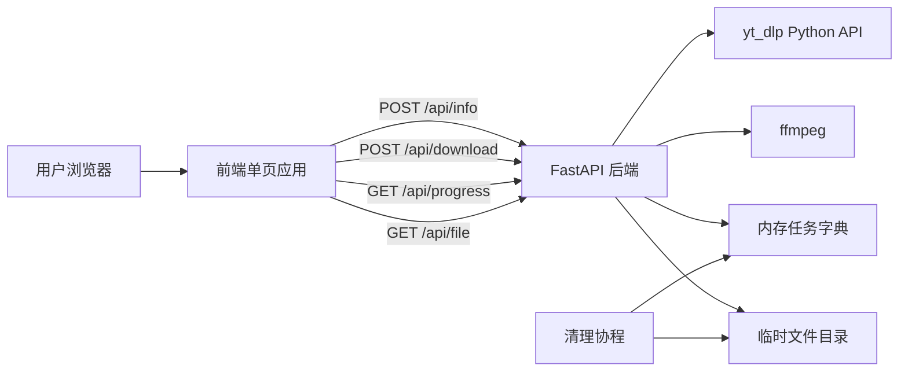
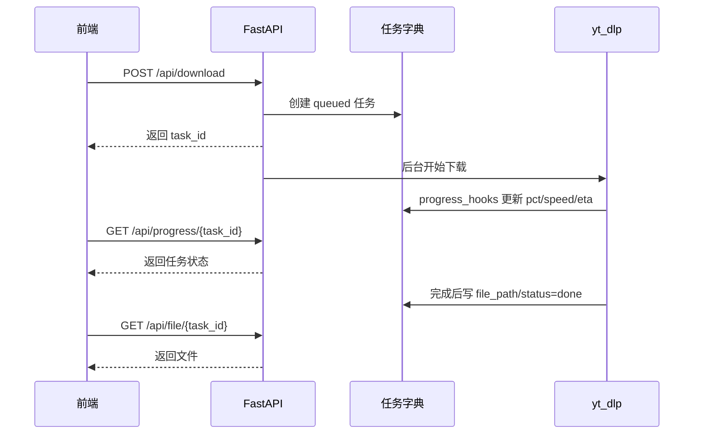

# 万能视频下载站方案设计

## 1. 架构概览



## 2. 技术选型

- 后端：Python + FastAPI。
- 下载核心：`yt-dlp` Python API。
- 音视频合并：`ffmpeg` 二进制。
- 前端：Vite + 原生 HTML/CSS/JS。
- 存储：MVP 不接数据库，任务状态存在内存，文件存在系统临时目录。
- 部署：可本地分离启动，也可前端构建后由 FastAPI 托管静态文件。

## 3. 后端模块

### `backend/app/config.py`

集中管理运行参数：

- `TEMP_ROOT`：临时下载目录。
- `TASK_TTL_SECONDS`：任务和文件保留时长，默认 30 分钟。
- `MAX_CONCURRENT_DOWNLOADS`：并发下载上限。
- `MAX_DURATION_SECONDS`：MVP 单视频最大时长限制。
- `DEFAULT_FORMAT`：默认 yt-dlp format selector。

### `backend/app/tasks.py`

维护任务状态：

- `TASKS`：内存字典，`task_id -> DownloadTask`。
- `DownloadTask`：记录状态、进度、速度、剩余时间、文件路径、错误信息。
- `DOWNLOAD_SEMAPHORE`：限制全局并发下载。
- `cleanup_expired_tasks()`：定期清理过期任务和临时文件。

### `backend/app/downloader.py`

封装 `yt-dlp`：

- `parse_video_info(url)`：只解析信息，不下载。
- `build_quality_options(formats)`：将原始 formats 聚合为用户可理解的清晰度选项。
- `create_download_task(url, quality)`：创建下载任务和临时目录。
- `run_download_task(task, url, quality)`：在线程中执行阻塞下载，并通过进度钩子更新任务状态。

常用清晰度映射：

```python
{
    "1080p": "bv*[height<=1080]+ba/b[height<=1080]",
    "720p": "bv*[height<=720]+ba/b[height<=720]",
    "480p": "bv*[height<=480]+ba/b[height<=480]",
    "audio": "bestaudio/best",
}
```

### `backend/app/api.py`

对外接口：

- `GET /api/health`
- `POST /api/info`
- `POST /api/download`
- `GET /api/progress/{task_id}`
- `GET /api/file/{task_id}`

### `backend/app/main.py`

- 创建 FastAPI 应用。
- 配置 CORS。
- 挂载 API 路由。
- 启动任务清理协程。
- 当前端构建产物存在时，挂载静态页面。

## 4. 前端模块

### `frontend/index.html`

单页营销型结构：

- 顶部导航。
- Hero 下载输入框。
- 视频解析结果卡。
- 下载进度卡。
- 支持平台信任条。
- 功能亮点。
- 定价区。
- FAQ 和免责声明。
- Pro 弹窗。

### `frontend/src/main.js`

负责核心交互：

- 调用 `/api/info` 解析视频。
- 渲染视频信息和清晰度选项。
- 调用 `/api/download` 创建任务。
- 每秒轮询 `/api/progress/{task_id}`。
- 完成后生成 `/api/file/{task_id}` 下载链接。

### `frontend/src/styles.css`

视觉方向：

- 蓝紫渐变主按钮。
- 金色 Pro 按钮和推荐标签。
- 白底圆角卡片。
- 柔和阴影和 hover 上浮。
- 移动端响应式布局。

## 5. 下载任务生命周期



## 6. 部署注意事项

- 生产环境必须安装 `ffmpeg`。
- MVP 内存任务字典不适合多进程 worker。如果需要多 worker，需要引入 Redis 或数据库。
- `yt-dlp` 要定期升级，以跟上平台变化。
- 临时文件目录建议独立磁盘或挂载卷，避免撑满系统盘。
- 后续上线前要增加更严格的 IP 限流和日志脱敏。

## 7. 合规策略

- 首页和 README 明确免责声明。
- 不绕过 DRM。
- 不长期缓存视频。
- 不存用户 cookies。
- 提供失败时的友好提示，避免误导用户认为所有内容都可下载。
